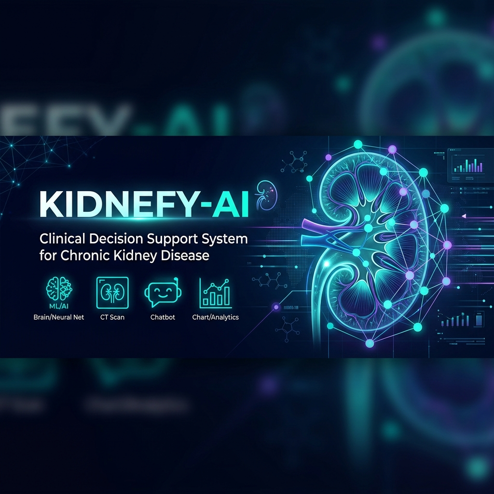
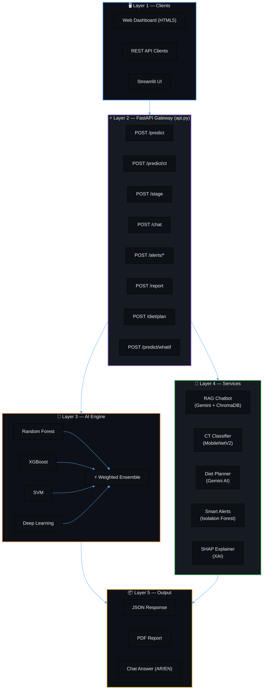
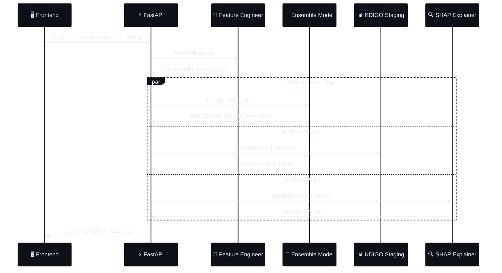
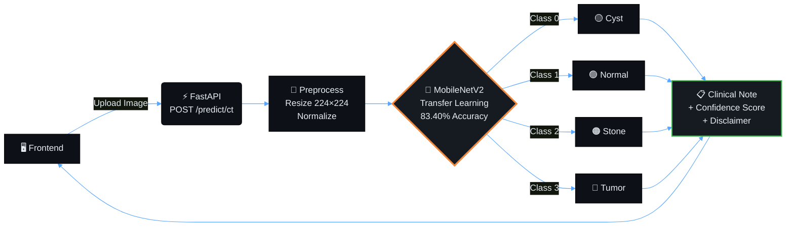
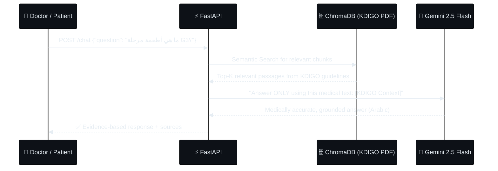
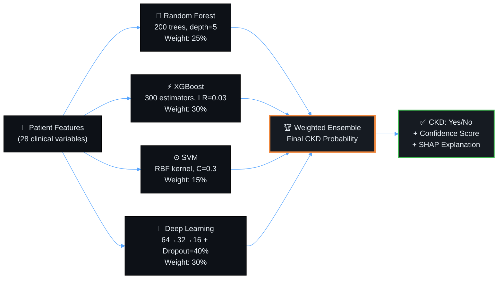

<div align="center">



<br/>


<h1>🩺 Kidnefy-AI</h1>

<p><strong>Clinical Decision Support System for Chronic Kidney Disease</strong></p>
<p><em>Graduation Project · Faculty of Computer Science · 2026</em></p>

<br/>

[](https://www.python.org/)
[](https://fastapi.tiangolo.com/)
[](https://www.tensorflow.org/)
[](https://aistudio.google.com/)
[](https://www.docker.com/)
[](LICENSE)

<br/>

[](https://github.com/amribrahim11vv/Kidnefy-Ai)
[](https://github.com/amribrahim11vv/Kidnefy-Ai)
[](https://github.com/amribrahim11vv/Kidnefy-Ai)
[](http://localhost:8000/docs)

</div>

---

## 🌟 What is Kidnefy-AI?

**Kidnefy-AI** is a full-stack **AI-powered Clinical Decision Support System (CDSS)** built to assist healthcare professionals in the early detection, staging, and management of **Chronic Kidney Disease (CKD)** — one of the world's leading causes of preventable death affecting over 850 million people globally.

The system combines cutting-edge **Machine Learning**, **Deep Learning**, **Retrieval-Augmented Generation (RAG)**, and **Medical Imaging** into a single unified platform — going far beyond a simple prediction model.

> **Think of Kidnefy-AI as a brilliant AI second opinion that works 24/7, speaks Arabic, and follows the latest KDIGO international guidelines.**

---

## ✨ Core AI Engines (8 Intelligent Modules)

<div align="center">

| # | Engine | Technology | Capability |
|:---:|:---:|:---:|:---|
| 🧠 | **CKD Prediction Ensemble** | XGBoost + RF + SVM + Deep Learning | Predicts CKD with **98.52% accuracy** |
| 📊 | **Clinical Staging Engine** | CKD-EPI Formula + KDIGO | Calculates eGFR & classifies into stages G1–G5 |
| 🤖 | **RAG Medical Chatbot** | Gemini 2.5 Flash + ChromaDB | Answers medical questions from KDIGO guidelines (Arabic/English) |
| ⚖️ | **What-If Treatment Simulator** | ML Ensemble + Clinical Rules | Simulates treatment outcomes before prescribing |
| 🚨 | **Smart Monitoring & Alerts** | Isolation Forest + Trend Analysis | Detects "Fast Progressors" & anomalies automatically |
| 📄 | **Medical Report Generator** | FPDF + HTML | Generates bilingual print-ready PDF reports |
| 🥗 | **AI Diet Planner** | Gemini 2.5 Flash + KDIGO Rules | Creates 7-day personalized kidney-safe meal plans |
| 🔬 | **CT Kidney Classifier** | MobileNetV2 (Transfer Learning) | Detects Normal / Cyst / Stone / Tumor from CT scans |

</div>

---

## 🏛️ System Architecture

### Master Architecture Overview



### Training Pipeline (Offline)

```mermaid
%%{init: {'theme': 'base', 'themeVariables': {'primaryColor': '#0d1117', 'primaryTextColor': '#e6edf3', 'lineColor': '#3fb950'}}}%%
flowchart LR
    A["📂 Raw Datasets\n3 CSV / XLSX\n~100K+ records"] --> B["🔀 DataLoader\nMerge + Dedupe"]
    B --> C["🏗️ Preprocessing\nKNN Imputation k=5"]
    C --> D["⚙️ Feature Engineering\nClinical Bins + eGFR"]
    D --> E["🔢 Scaling\nStandardScaler"]
    E --> F["✂️ Selection\nSelectFromModel"]
    F --> G["⚖️ SMOTE\nClass Balancing"]
    G --> H["🤖 Train 4 Models\nRF + XGB + SVM + DNN"]
    H --> I["🏆 Weighted Ensemble\n10-Fold CV Validated"]
    I --> J["💾 Save Models\n.joblib + .keras"]

    style A fill:#161b22,stroke:#58a6ff,color:#e6edf3
    style H fill:#161b22,stroke:#f0883e,stroke-width:2px,color:#e6edf3
    style I fill:#161b22,stroke:#f0883e,stroke-width:3px,color:#e6edf3
    style J fill:#161b22,stroke:#d29922,stroke-width:2px,color:#e6edf3
```



### Real-Time Inference Pipeline



### CT Scan Classification Flow



### RAG Medical Chatbot Flow



---

## 🚀 Quick Start

### Option 1: One-Click Setup (Windows) — Recommended

```bash
# 1. Clone the repository (Git LFS required for model weights)
git lfs install
git clone https://github.com/amribrahim11vv/Kidnefy-Ai.git
cd Kidnefy-Ai

# 2. Add your Gemini API key to .env
cp .env.example .env
# Edit .env: GEMINI_API_KEY=your_key_here

# 3. Double-click setup_and_run.bat
#    OR run in terminal:
.\setup_and_run.bat
```

✅ The script automatically:
- Creates a Python virtual environment
- Installs all dependencies from `requirements.txt`
- Starts the FastAPI server at `http://127.0.0.1:8000`
- Opens Swagger UI at `http://127.0.0.1:8000/docs`

---

### Option 2: Manual Setup (Mac/Linux)

```bash
# Create virtual environment
python -m venv .venv
source .venv/bin/activate       # Windows: .venv\Scripts\activate

# Install dependencies
pip install -r requirements.txt

# Configure environment
cp .env.example .env
# Edit .env and add: GEMINI_API_KEY=your_key_here

# Start the API server
uvicorn api:app --host 0.0.0.0 --port 8000 --reload
```

---

### Option 3: Docker Compose

```bash
# Build and run all services
docker-compose up --build

# API will be available at:
# http://localhost:8000/docs
```

---

## 📡 API Reference

> **Base URL:** `http://localhost:8000`  
> **Interactive Docs:** `http://localhost:8000/docs`  
> **All endpoints accept and return JSON**

### 1. 🧠 CKD Prediction (Main Endpoint)

```http
POST /predict
Content-Type: application/json
```

```json
{
  "patient": {
    "name": "محمد أحمد",
    "age": 65,
    "sex": "male"
  },
  "lab_values": {
    "creatinine": 2.8,
    "acr": 120.0,
    "blood_urea": 55.0,
    "sodium": 138,
    "potassium": 5.1,
    "hba1c": 7.5
  }
}
```

**Response:**
```json
{
  "prediction": true,
  "probability": 0.9245,
  "confidence": 0.8832,
  "egfr": 23.4,
  "gfr_stage": "G4",
  "risk_level": "Very High Risk",
  "progression_risk_percent": 78.5,
  "recommendations": ["Nephrology referral urgent", "Restrict protein to 0.6g/kg/day"],
  "xai_explanation": {
    "top_risk_factors": [
      {"feature": "egfr_computed", "impact": "+38.2%"},
      {"feature": "creatinine", "impact": "+22.1%"}
    ]
  }
}
```

---

### 2. 🔬 CT Kidney Image Analysis

```http
POST /predict/ct
Content-Type: multipart/form-data
```

```bash
curl -X POST "http://localhost:8000/predict/ct" \
  -F "file=@kidney_scan.jpg"
```

**Response:**
```json
{
  "prediction": "Cyst",
  "confidence": 0.9127,
  "all_probabilities": {
    "Cyst": 0.9127, "Normal": 0.0521, "Stone": 0.0289, "Tumor": 0.0063
  },
  "clinical_note": "Renal cyst detected. Recommend follow-up ultrasound."
}
```

---

### 3. 🥗 7-Day AI Diet Plan

```http
POST /diet/plan
Content-Type: application/json
```

```json
{
  "age": 60,
  "weight": 85,
  "egfr": 28,
  "potassium": 5.8,
  "sodium": 145,
  "diabetes": "yes",
  "hypertension": "yes"
}
```

---

### 4. 🤖 Medical Chatbot (RAG)

```http
POST /chat
Content-Type: application/json
```

```json
{
  "question": "كيف أقلل البوتاسيوم في نظامي الغذائي؟"
}
```

---

### 5. ⚖️ What-If Treatment Simulator

```http
POST /predict/whatif
Content-Type: application/json
```

```json
{
  "baseline": { "age": 60, "sex": "male", "sc": 2.5, "bp": 160, "al": 2, "dm": "no" },
  "modified":  { "age": 60, "sex": "male", "sc": 1.8, "bp": 125, "al": 0, "dm": "no" }
}
```

**Response:**
```json
{
  "deltas": {
    "probability": -0.3142,
    "egfr": +15.3,
    "stage_change": "G3b → G3a",
    "risk_improved": true
  }
}
```

---

### 6. 📊 CKD Staging

```http
POST /stage
Content-Type: application/json
```

```json
{
  "creatinine": 2.3,
  "age": 65,
  "acr": 45.0,
  "is_female": false
}
```

---

### 7. 🚨 Smart Patient Monitoring

```http
POST /monitor/add        # Record a new measurement
POST /alerts/analyze     # Analyze patient for anomalies  
POST /alerts/symptoms    # Analyze symptoms (Arabic/English NLP)
GET  /alerts/patient/{id} # Get all alerts for a patient
```

---

### 8. 📄 Report Generation

```http
POST /report/generate    # Generate full PDF report
GET  /report/download/{filename}  # Download the PDF
```

---

## 📊 AI Model Performance

<div align="center">

| Model | Technology | Performance | Notes |
|:---:|:---:|:---:|:---|
| 🧠 **CKD Prediction** | XGBoost + RF + SVM + DNN Ensemble | **98.52% Accuracy** | 10-Fold CV validated, anti-leakage splits |
| 🔬 **CT Scan Classifier** | MobileNetV2 (Transfer Learning) | **83.40% Accuracy** | Normal / Cyst / Stone / Tumor |
| 🤖 **RAG Chatbot** | Gemini 2.5 Flash + ChromaDB | Context-Grounded | KDIGO 2012 guidelines knowledge base |
| 🥗 **Diet Planner** | Gemini 2.5 Flash | Rule-Strict | KDIGO nutritional guidelines enforced |
| 🔍 **SHAP Explainer** | TreeExplainer | Feature-Level | Full explainability for every prediction |

</div>

### Ensemble Model Architecture



---

## 📁 Project Structure

```
Kidnefy-AI/
│
├── 📄 api.py                    ← The Brain: All 15+ FastAPI endpoints (1,600 lines)
├── ⚙️ config.py                 ← Central config: feature names, defaults, paths
├── 🔧 setup_and_run.bat         ← One-click Windows setup script
├── 🐳 docker-compose.yml        ← Docker multi-service config
├── 📋 requirements.txt          ← All Python dependencies
│
├── 📂 src/                      ← Core Source Code
│   ├── preprocessing/           ← DataLoader, FeatureEngineer (SMOTE, KNN, scaling)
│   ├── models/                  ← MLModels, DLModel, EnsembleModel, StagingModel
│   ├── staging/                 ← GFRCalculator (CKD-EPI 2021), RiskAssessor
│   ├── rag/                     ← GeminiRAG (ChromaDB), SmartDietPlanner
│   ├── monitoring/              ← LongitudinalMonitor, SmartAlertEngine (Isolation Forest)
│   ├── imaging/                 ← KidneyImageClassifier (MobileNetV2 CNN)
│   ├── reports/                 ← PDFReportGenerator (FPDF, bilingual)
│   └── explainability/          ← SHAPExplainer (TreeExplainer)
│
├── 📂 models/                   ← Trained AI Model Weights
│   ├── ensemble_dl_model.keras  ← Deep Learning model (Keras)
│   ├── xgboost_model.joblib     ← XGBoost model
│   ├── random_forest_model.joblib
│   ├── svm_model.joblib
│   ├── scaler.joblib            ← StandardScaler (fitted on training data)
│   ├── feature_engineer.joblib  ← FeatureEngineer (bins, interactions)
│   └── kidney_ct_classifier.keras ← CT Image Classifier (24MB)
│
├── 📂 frontend/
│   ├── dashboard.html           ← Full interactive HTML5 dashboard (94KB)
│   └── streamlit_app.py         ← Alternative Streamlit UI
│
├── 📂 docs/
│   ├── logo.jpeg                ← Project logo
│   ├── banner.png               ← Project banner
│   ├── ARCHITECTURE.md          ← Detailed system architecture
│   ├── TEAM_ONBOARDING_GUIDE.md ← New developer guide
│   ├── api_contract.md          ← Full API contract for frontend devs
│   └── Kidney_Disease_API.postman_collection.json  ← Postman collection
│
├── 📂 knowledge_base/           ← KDIGO PDF guidelines for RAG
├── 📂 data/                     ← Training datasets (gitignored if large)
├── 📂 scripts/                  ← Training & evaluation scripts
└── 📂 tests/                    ← Unit tests
```

---

## 🛡️ Key Design Principles

### Anti-Overfitting Architecture

Every design decision in this system is engineered to prevent overfitting, which is critical in medical AI:

```
✅ Split BEFORE clean — training data never sees validation/test
✅ XGBoost: max_depth=3, early_stopping_rounds=15, subsample=0.6
✅ Random Forest: max_depth=5, min_samples_leaf=8
✅ SVM: C=0.3 (soft margin)
✅ DNN: Dropout=40%, L2 regularization, BatchNormalization
✅ 10-Fold Cross-Validation on training data
✅ SMOTE applied ONLY to training split (never test)
```

### Anti-Data-Leakage Measures

```
✅ Scaler.fit() called ONLY on training data
✅ FeatureSelector.fit() ONLY on training data
✅ All leaky columns removed (CKD symptoms used as labels)
✅ eGFR computed mathematically, not learned (pure formula)
✅ KNN Imputer fitted on training, only transformed on val/test
```

---

## 🔑 Environment Configuration

Create a `.env` file in the project root:

```bash
# Required for RAG Chatbot & Diet Planner
GEMINI_API_KEY=your_google_gemini_api_key_here

# Optional (for production)
CORS_ORIGINS=http://localhost:3000,http://yourfrontenddomain.com
```

> **Get your free Gemini API key at:** [aistudio.google.com](https://aistudio.google.com/apikey)

---

## 🐳 Docker Deployment

```bash
# Production deployment
docker-compose up -d

# Check logs
docker-compose logs -f api

# Scale if needed
docker-compose up -d --scale api=3
```

Services exposed:
- **API:** `http://localhost:8000`
- **Swagger Docs:** `http://localhost:8000/docs`

---

## 🧪 Testing

```bash
# Run all unit tests
pytest tests/ -v

# Test a live prediction (server must be running)
python test_api.py

# Run 5000-patient stress test
python scripts/test_complex_patients.py
```

---

## 🩺 KDIGO Stage Reference

<div align="center">

| Stage | eGFR (mL/min/1.73m²) | Description | Action |
|:---:|:---:|:---|:---|
| **G1** | ≥ 90 | Normal or high | Monitor annually |
| **G2** | 60 – 89 | Mildly decreased | Lifestyle changes |
| **G3a** | 45 – 59 | Mildly–moderately decreased | Nephrology referral |
| **G3b** | 30 – 44 | Moderately–severely decreased | 3-month follow-up |
| **G4** | 15 – 29 | Severely decreased | Dialysis preparation |
| **G5** | < 15 | Kidney failure | Dialysis / Transplant |

</div>

---

## 🗓️ Development Roadmap

- [x] CKD Prediction Ensemble (XGBoost + RF + SVM + DNN)
- [x] KDIGO Clinical Staging Engine (G1–G5)
- [x] RAG Medical Chatbot (Gemini + ChromaDB)
- [x] CT Kidney Image Classifier (MobileNetV2)
- [x] What-If Treatment Simulator
- [x] Smart Monitoring & Anomaly Detection (Isolation Forest)
- [x] Bilingual PDF Report Generator (Arabic/English)
- [x] AI Diet Planner (7-day, KDIGO-compliant)
- [x] SHAP Explainability (XAI) 
- [x] Docker Deployment
- [ ] Mobile App (Flutter)
- [ ] Integration with Hospital HIS Systems
- [ ] Real-time Patient Dashboard with WebSockets

---

## 👥 Team

<div align="center">

**Kidnefy-AI Graduation Project — Faculty of Computer Science — 2026**

Built with ❤️ and a lot of medical research.

</div>

---

## 📚 References & Acknowledgements

- **KDIGO 2012 Clinical Practice Guidelines** for CKD evaluation and management
- **CKD-EPI 2021 Equation** for eGFR calculation (race-free formula)
- **UCI CKD Dataset** — primary training data (400 clinical patients)
- **Google Gemini API** — for RAG and diet planning
- **ChromaDB** — open-source vector database for RAG knowledge base
- **SHAP (SHapley Additive exPlanations)** — for model explainability

---

<div align="center">

**⭐ If this project helped you, please give it a star!**

[](https://github.com/amribrahim11vv/Kidnefy-Ai)
[](https://github.com/amribrahim11vv/Kidnefy-Ai/fork)

<sub>© 2026 Kidnefy-AI Project Team — For Academic & Research Purposes</sub>

</div>
