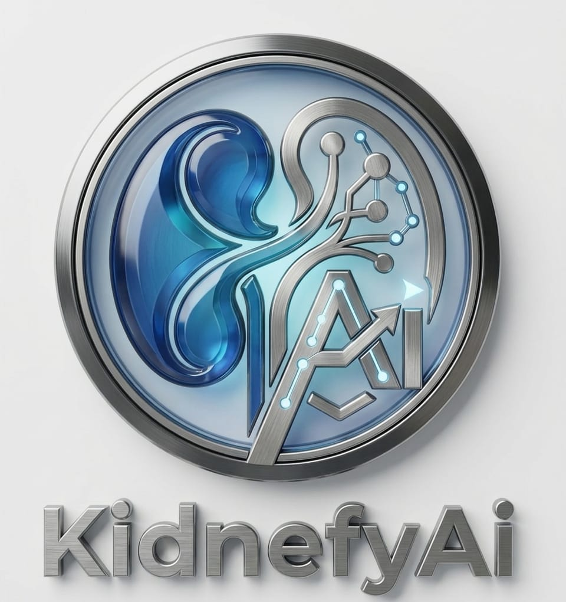
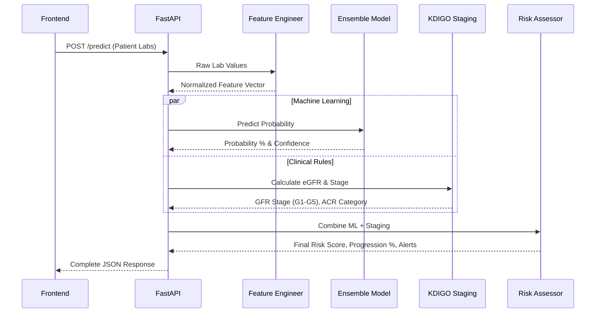
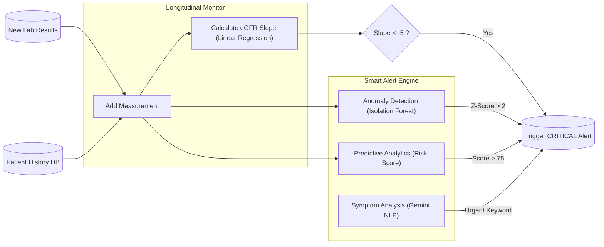

<div align="center">
  
  <h1>Kidnefy-AI: Advanced Kidney Disease Prediction System</h1>
  <p><strong>A comprehensive AI-powered medical platform for detecting, staging, and monitoring Chronic Kidney Disease (CKD) and Diabetic Nephropathy.</strong></p>

  [](https://fastapi.tiangolo.com/)
  [](https://www.python.org/)
  [](https://www.tensorflow.org/)
  [](https://aistudio.google.com/)
</div>

---

## 🌟 Overview & Key Features

Kidnefy-AI is not just a prediction model; it is a full **Clinical Decision Support System (CDSS)** equipped with 6 major AI engines working together:

1. 🧠 **ML/DL Prediction Ensemble**: Combines XGBoost (97%), Random Forest, SVM, and a TensorFlow Neural Network (96.95%) to detect CKD with extremely high accuracy.
2. 📊 **Clinical Staging Engine**: Uses KDIGO 2012 guidelines to calculate eGFR (CKD-EPI 2021) and classify patients into stages G1–G5 and Albuminuria categories A1-A3.
3. 📸 **OCR Text Extraction**: Allows patients to upload photos of lab reports. Powered by EasyOCR with custom Regex rules adapted for complex Arabic/English medical lab formats.
4. 🩺 **RAG Medical Chatbot**: A specialized medical assistant powered by **Google Gemini** and ChromaDB. It reads KDIGO guidelines and answers patient questions in Arabic, taking their *actual lab results* into context.
5. ⚖️ **What-If Treatment Simulator**: Allows doctors to simulate treatment plans (e.g., "What if we reduce blood pressure to 120?") and instantly calculates the reduction in risk probability and clinical staging.
6. 🚨 **Smart Alerts & Monitoring**: Tracks patient history longitudinally. Uses **Isolation Forest (Machine Learning)** for personalized anomaly detection and predictive risk scoring, triggering alerts for "Fast Progressors".
7. 📄 **Bilingual HTML Reports**: Automatically generates visually stunning, print-ready medical reports in both Arabic and English.

---

## 🏛️ System Architecture

The project is built around a robust FastAPI backend that orchestrates multiple AI and clinical rule-based engines.

```mermaid
graph TD
    %% Define Nodes
    Client["Frontend Dashboard (HTML/JS)"]
    API["FastAPI Backend (api.py)"]
    
    submap CoreModules ["Core AI & Clinical Modules"]
        Staging["Staging Engine (KDIGO)"]
        Prediction["Prediction Ensemble (XGBoost + DL)"]
        OCR["OCR Engine (EasyOCR)"]
        RAG["Medical Chatbot (Gemini RAG)"]
        Monitoring["Smart Alerts & Monitoring"]
        Reports["Report Generator (HTML)"]
    end
    
    %% Define Relationships
    Client -->|REST API Calls| API
    
    API -->|"/stage"| Staging
    API -->|"/predict & /predict/whatif"| Prediction
    API -->|"/predict/image"| OCR
    API -->|"/chat"| RAG
    API -->|"/alerts/*"| Monitoring
    API -->|"/report"| Reports
    
    %% Cross-module communications
    Prediction --> Staging
    Monitoring --> Staging
    RAG -.->|"Patient Context"| Monitoring
```

### Prediction & What-If Flow



### Smart Alerts & Longitudinal Monitoring



---

## 🚀 Setup & Installation (Step-by-Step)

### Prerequisites
- **Python 3.9 – 3.11** (Strictly required for TensorFlow compatibility)
- **Git** (with Git LFS installed for large model files)

### 1. Clone the Repository
```bash
git lfs install
git clone https://github.com/amribrahim11vv/Kidnefy-Ai.git
cd Kidnefy-Ai
```

### 2. Create Virtual Environment
```bash
# Create
python -m venv .venv

# Activate (Windows)
.venv\Scripts\activate

# Activate (Linux/Mac)
source .venv/bin/activate
```

### 3. Install Dependencies
```bash
pip install -r requirements.txt
```
> ⚠️ **Note**: TensorFlow and EasyOCR are large downloads. Initial installation may take a few minutes.

### 4. Configure Environment Variables
You need a Google Gemini API key to activate the Medical Chatbot and NLP Symptom Analysis features.
```bash
# Copy the example file
copy .env.example .env
```
Edit `.env` and paste your Gemini API key (Get a FREE key from: [Google AI Studio](https://aistudio.google.com/app/apikey)):
```env
GEMINI_API_KEY=AIzaSyXXXXXXXXXXXXXXXXXXXX
```

### 5. Run the Server
```bash
uvicorn api:app --host 0.0.0.0 --port 8000 --reload
```
You should see all AI engines initialize successfully in your terminal.

---

## 📁 Project Structure

```text
kidney_disease_prediction/
|-- api.py                    <- FastAPI Backend (main entry point)
|-- main.py                   <- CLI for training & prediction
|-- train_diabetes.py         <- Diabetes training pipeline
|-- config.py                 <- Central configuration
|-- streamlit_app.py          <- Interactive Streamlit Demo
|-- dashboard.html            <- HTML Frontend Prototype
|-- requirements.txt          <- All dependencies (pinned)
|-- .env.example              <- Environment variable template
|-- Dockerfile                <- Docker image definition
|-- docker-compose.yml        <- One-command deployment
|-- setup.bat                 <- Windows one-click setup
|-- run_server.bat            <- Windows one-click server start
|-- Kidney_Disease_API.postman_collection.json  <- Postman testing
|
|-- src/                      <- All AI source modules
|   |-- models/               ML, DL, Ensemble, Staging wrappers
|   |-- preprocessing/        Data loading & feature engineering
|   |-- staging/              eGFR (CKD-EPI 2021) + KDIGO risk
|   |-- monitoring/           Smart Alerts + Longitudinal Monitor
|   |-- ocr/                  Image processing + text extraction
|   |-- rag/                  Gemini RAG + ChromaDB knowledge base
|   |-- reports/              HTML report generator
|   +-- explainability/       SHAP-based XAI
|
|-- models/                   <- Pre-trained models (ready to use)
|   |-- staging/              XGBoost staging model + scaler
|   +-- diabetes/             RF, SVM, XGBoost diabetes models
|
|-- data/raw/                 <- Datasets (CKD + Diabetes)
|-- tests/                    <- All test & verification scripts
|-- scripts/                  <- Utility scripts (data analysis, etc.)
|-- docs/                     <- Project documentation (AR + EN)
|-- sample_images/            <- Sample lab reports for OCR testing
+-- notebooks/                <- Jupyter notebooks
```

---

## 📡 API Endpoints Reference

The FastAPI backend provides a rich, documented API. Once the server is running, visit **`http://localhost:8000/docs`** for the interactive Swagger UI.

### 🧪 Core Endpoints
| Method | Endpoint | Description |
|--------|----------|-------------|
| `POST` | `/predict` | Predict CKD probability from lab values (JSON) |
| `POST` | `/predict/whatif` | **[NEW]** Simulate treatment changes to see risk reduction |
| `POST` | `/predict/image` | Upload a lab report image (OCR extraction) |
| `POST` | `/stage` | Calculate KDIGO staging & eGFR |

### 🤖 AI & Monitoring Features
| Method | Endpoint | Description |
|--------|----------|-------------|
| `POST` | `/chat` | **[NEW]** RAG Medical Chatbot (Ask questions based on guidelines) |
| `POST` | `/diet/plan` | **[NEW]** 🥗 Generate a 7-day personalized kidney-safe meal plan |
| `POST` | `/explain` | AI explanation of prediction results (SHAP) |
| `POST` | `/alerts/symptoms` | NLP symptom analysis (Gemini integration) |
| `GET` | `/alerts/patient/{id}` | Get patient longitudinal anomalies & fast progressor status |

### 📄 Reports
| Method | Endpoint | Description |
|--------|----------|-------------|
| `POST` | `/report` | Generate Bilingual HTML Medical Report |

---

## 💻 For Frontend Integration

**Base URL**: `http://localhost:8000`

**1. Predict CKD (Standard Request)**
```javascript
const response = await fetch('http://localhost:8000/predict', {
  method: 'POST',
  headers: { 'Content-Type': 'application/json' },
  body: JSON.stringify({
    patient: { name: "Ahmed", age: 58, sex: "male" },
    lab_values: { creatinine: 2.3, acr: 150, blood_pressure: 140 }
  })
});
const result = await response.json();
console.log(result.gfr_stage);  // "G3b"
```

**2. What-If Simulator**
```javascript
const response = await fetch('http://localhost:8000/predict/whatif', {
  method: 'POST',
  headers: { 'Content-Type': 'application/json' },
  body: JSON.stringify({
    baseline: { age: 60, sex: "male", sc: 2.5, bp: 160, al: 2, dm: "no" },
    modified: { age: 60, sex: "male", sc: 1.8, bp: 125, al: 0, dm: "no" } // Simulated treatment
  })
});
```

**3. Medical Chatbot**
```javascript
const response = await fetch('http://localhost:8000/chat', {
  method: 'POST',
  headers: { 'Content-Type': 'application/json' },
  body: JSON.stringify({ question: "ما هي الأطعمة الممنوعة في المرحلة الرابعة؟" })
});
const result = await response.json();
console.log(result.answer);
```

---

## 🛠️ Tech Stack

| Category | Technology |
|---|---|
| **Machine Learning** | TensorFlow 2.15, Scikit-learn (Isolation Forest), XGBoost |
| **Computer Vision (OCR)** | EasyOCR, OpenCV, PyTesseract |
| **Generative AI** | Google Gemini 2.5 Flash, ChromaDB (Vector Search) |
| **Backend API** | FastAPI, Uvicorn, Pydantic |
| **Frontend Prototype** | HTML5, CSS3, Vanilla JS |

---

## 📈 Model Performance

| Model | Dataset | Accuracy |
|---|---|---|
| CKD Staging (XGBoost) | 4,400 records | **98.52%** |
| Diabetes (XGBoost) | 100,000 records | **97.00%** |
| Diabetes (Deep Learning) | 100,000 records | **96.95%** |
| CKD/Diabetes Ensemble | Combined Data | **97.00%** |

---

## 👨‍💻 Authors
Developed by the Graduation Project Team — 2026.
