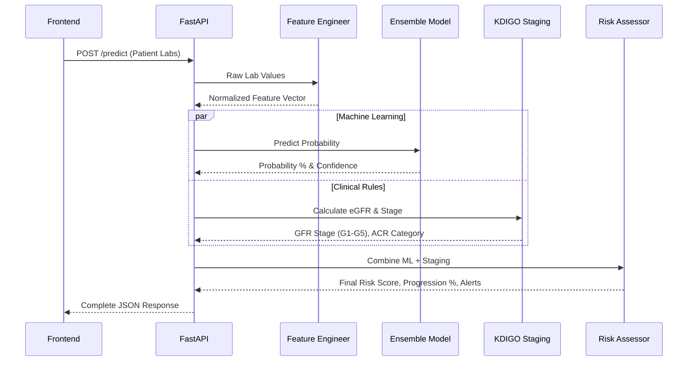
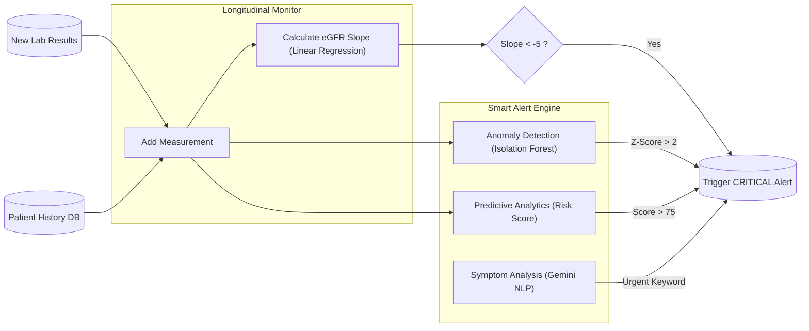

#  Kidney Disease Prediction System (AI Engine + API)

##  Overview
AI-powered system for detecting **Chronic Kidney Disease (CKD)** and **Diabetic Nephropathy**:
- **ML/DL Ensemble**: XGBoost (97%), Random Forest, SVM + TensorFlow Neural Network (96.95%)
- **CKD Staging**: XGBoost classifier with 98.52% accuracy (KDIGO-based G1–G5)
- **OCR Module**: Extract lab values from medical report images (EasyOCR)
- **RAG Chatbot**: Medical Q&A via Google Gemini (Arabic + English)
- **Smart Alerts**: Anomaly detection, NLP symptom analysis, predictive risk
- **FastAPI Backend**: Full REST API for frontend integration

---

## 🏛️ System Architecture

## 1. High-Level System Architecture

The project is built around a robust FastAPI backend that orchestrates multiple AI and clinical rule-based engines.

```mermaid
graph TD
    %% Define Nodes
    Client["Frontend Dashboard (HTML/JS)"]
    API["FastAPI Backend (api.py)"]
    
    submap CoreModules ["Core AI & Clinical Modules"]
        Staging["Staging Engine (KDIGO)"]
        Prediction["Prediction Ensemble (XGBoost + DL)"]
        OCR["OCR Engine (EasyOCR)"]
        RAG["Medical Chatbot (Gemini RAG)"]
        Monitoring["Smart Alerts & Monitoring"]
        Reports["Report Generator (HTML/PDF)"]
    end
    
    %% Define Relationships
    Client -->|REST API Calls| API
    
    API -->|"/stage"| Staging
    API -->|"/predict & /predict/whatif"| Prediction
    API -->|"/predict/image"| OCR
    API -->|"/chat"| RAG
    API -->|"/alerts/*"| Monitoring
    API -->|"/report"| Reports
    
    %% Cross-module communications
    Prediction --> Staging
    Monitoring --> Staging
    RAG -.->|"Patient Context"| Monitoring
```

---

## 2. Prediction & What-If Flow

When a patient's data is submitted for prediction or what-if simulation, it passes through multiple layers to ensure medical accuracy.



---

## 3. Smart Alerts & Longitudinal Monitoring

This system tracks a patient's health over time and uses Machine Learning to detect sudden anomalies or rapid decline.



---

## Technical Stack Summary

*   **Backend Framework:** FastAPI (Python)
*   **Machine Learning:** XGBoost, TensorFlow/Keras, Scikit-learn (Isolation Forest)
*   **Clinical Rules:** KDIGO 2012 Guidelines (CKD-EPI equation)
*   **Generative AI:** Google Gemini (RAG, Symptom Analysis)
*   **OCR:** EasyOCR / Tesseract
*   **Vector DB:** ChromaDB (for medical knowledge base)


---

##  Setup (Step-by-Step)

### Prerequisites
- **Python 3.9 – 3.11** (required for TensorFlow compatibility)
- **Git** (with Git LFS for large model files)

### Step 1: Clone the Repository
```bash
git lfs install
git clone <YOUR_REPO_URL>
cd kidney_disease_prediction
```

### Step 2: Create Virtual Environment
```bash
# Create
python -m venv .venv

# Activate (Windows)
.venv\Scripts\activate

# Activate (Linux/Mac)
source .venv/bin/activate
```

### Step 3: Install Dependencies
```bash
pip install -r requirements.txt
```

> ⚠️ **Note**: TensorFlow and EasyOCR are large downloads (~500MB+). Be patient on first install.

### Step 4: Configure Environment Variables
```bash
# Copy the example file
copy .env.example .env

# Then edit .env and paste your Gemini API key
# Get a FREE key from: https://aistudio.google.com/app/apikey
```

The `.env` file should look like:
```
GEMINI_API_KEY=AIzaSyXXXXXXXXXXXXXXXXXXXX
```

>  Everything works WITHOUT the key except the RAG Chatbot.

### Step 5: Run the API Server
```bash
uvicorn api:app --host 0.0.0.0 --port 8000
```

You should see:
```
✅ ML models loaded successfully
✅ AI Staging Model Loaded
✅ OCR engine initialized
✅ RAG engine initialized
✅ Smart Alert Engine initialized
✅ API ready!
```

- **API**: http://localhost:8000
- **Swagger Docs**: http://localhost:8000/docs
- **ReDoc**: http://localhost:8000/redoc

---

## Project Structure

```
kidney_disease_prediction/
|-- api.py                    <- FastAPI Backend (main entry point)
|-- main.py                   <- CLI for training & prediction
|-- train_diabetes.py         <- Diabetes training pipeline
|-- config.py                 <- Central configuration
|-- streamlit_app.py          <- Interactive Streamlit Demo
|-- dashboard.html            <- HTML Frontend Prototype
|-- requirements.txt          <- All dependencies (pinned)
|-- .env.example              <- Environment variable template
|-- Dockerfile                <- Docker image definition
|-- docker-compose.yml        <- One-command deployment
|-- setup.bat                 <- Windows one-click setup
|-- run_server.bat            <- Windows one-click server start
|-- Kidney_Disease_API.postman_collection.json  <- Postman testing
|
|-- src/                      <- All AI source modules
|   |-- models/               ML, DL, Ensemble, Staging wrappers
|   |-- preprocessing/        Data loading & feature engineering
|   |-- staging/              eGFR (CKD-EPI 2021) + KDIGO risk
|   |-- monitoring/           Smart Alerts + Longitudinal Monitor
|   |-- ocr/                  Image processing + text extraction
|   |-- rag/                  Gemini RAG + ChromaDB knowledge base
|   |-- reports/              PDF report generator
|   +-- explainability/       SHAP-based XAI
|
|-- models/                   <- Pre-trained models (ready to use)
|   |-- staging/              XGBoost staging model + scaler
|   +-- diabetes/             RF, SVM, XGBoost diabetes models
|
|-- data/raw/                 <- Datasets (CKD + Diabetes)
|-- tests/                    <- All test & verification scripts
|-- scripts/                  <- Utility scripts (data analysis, etc.)
|-- docs/                     <- Project documentation (AR + EN)
|-- sample_images/            <- Sample lab reports for OCR testing
+-- notebooks/                <- Jupyter notebooks
```


---

##  API Endpoints Reference

### Core Endpoints
| Method | Endpoint | Description |
|--------|----------|-------------|
| `GET` | `/health` | Health check (model status) |
| `POST` | `/predict` | Predict CKD from lab values (JSON) |
| `POST` | `/predict/image` | Predict from lab image (OCR) |
| `POST` | `/stage` | Calculate KDIGO staging |
| `POST` | `/egfr` | Calculate eGFR value |

### AI Features
| Method | Endpoint | Description |
|--------|----------|-------------|
| `POST` | `/chat` | RAG Medical Chatbot (Arabic/English) |
| `POST` | `/explain` | AI explanation of results |
| `POST` | `/alerts/symptoms` | NLP symptom analysis |
| `POST` | `/alerts/analyze` | Anomaly detection scan |
| `GET` | `/alerts/patient/{id}` | Get patient alerts |

### Reports
| Method | Endpoint | Description |
|--------|----------|-------------|
| `POST` | `/report` | Generate PDF report |
| `GET` | `/report/download/{file}` | Download PDF |

>  Full interactive docs at: `http://localhost:8000/docs`

---

##  For Frontend Developers

**Base URL**: `http://localhost:8000` (or your deployed Render/Railway URL)

**Example: Predict CKD** (JavaScript `fetch`):
```javascript
const response = await fetch('http://localhost:8000/predict', {
  method: 'POST',
  headers: { 'Content-Type': 'application/json' },
  body: JSON.stringify({
    patient: { name: "Ahmed", age: 58, sex: "male" },
    lab_values: { creatinine: 2.3, acr: 150, blood_pressure: 140 }
  })
});
const result = await response.json();
console.log(result.gfr_stage);  // "G3b"
console.log(result.risk_level); // "High Risk"
```

**Example: Chat with AI** (JavaScript `fetch`):
```javascript
const response = await fetch('http://localhost:8000/chat', {
  method: 'POST',
  headers: { 'Content-Type': 'application/json' },
  body: JSON.stringify({ question: "ما هي مراحل مرض الكلى المزمن؟" })
});
const result = await response.json();
console.log(result.answer);
```

**Reference UI**: See `dashboard.html` for a working prototype with all 4 features.

---

##  Running Tests
```bash
# OCR tests (85 tests)
python tests/test_ocr.py

# Smart Alerts tests (32 tests)
python tests/test_smart_alerts_standalone.py

# API client test (requires running server)
python tests/test_client.py
```

---

##  Deployment (Render.com)

1. Push code to **GitHub** (Git LFS handles large model files)
2. Go to [render.com](https://render.com) → **New Web Service**
3. Connect your GitHub repo
4. Settings:
   - **Build Command**: `pip install -r requirements.txt`
   - **Start Command**: `uvicorn api:app --host 0.0.0.0 --port $PORT`
5. Add Environment Variable: `GEMINI_API_KEY` = your key
6. Deploy! Your API will be live at `https://your-app.onrender.com`

---

## ️ Tech Stack
| Category | Technology |
|---|---|
| **AI/ML** | TensorFlow 2.15, Scikit-learn, XGBoost |
| **OCR** | EasyOCR, OpenCV |
| **LLM** | Google Gemini 2.5 Flash, ChromaDB |
| **API** | FastAPI, Uvicorn, Pydantic |
| **Reports** | ReportLab (PDF) |

---

##  Model Performance

| Model | Dataset | Accuracy |
|---|---|---|
| CKD Staging (XGBoost) | 4400 records | **98.52%** |
| Diabetes (XGBoost) | 100,000 records | **97.00%** |
| Diabetes (Deep Learning) | 100,000 records | **96.95%** |
| Diabetes (Ensemble) | Combined | **97.00%** |

---

## ‍ Authors
Graduation Project Team — 2026
